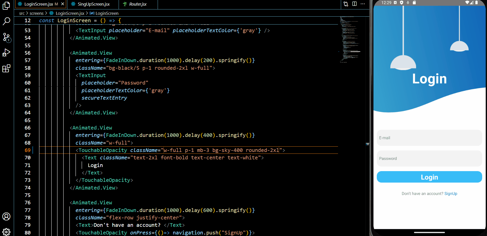

<h2>React-Native çalışmasında; View,
  Text,
  Image,
  StatusBar,
  TextInput,
  TouchableOpacity özellikleri kullanılmış,React-Native Animated kütüphanesi import edilmiş ve animasyonlu bir çalışma yapılmıştır.</h2>

<h4>Video döküman(gif) dosyası yüklenmiştir.</h4>

